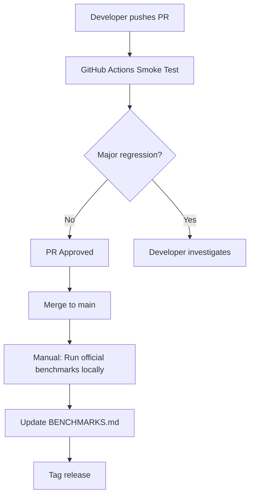

# Benchmark CI Strategy for metal-candle

## Overview

This document outlines the benchmarking strategy for metal-candle, balancing automation with accuracy requirements.

## Problem Statement

metal-candle's value proposition depends on **proving performance superiority over MLX**. This requires:
- Accurate, reproducible benchmark results
- Consistent hardware environment
- Minimal thermal/load variability

GitHub Actions shared runners cannot provide this level of consistency.

## Solution: Hybrid Approach

### 1. GitHub Actions: Smoke Tests (Automated)

**Purpose:** Catch major performance regressions (>20%) in PRs

**Workflow:** `.github/workflows/benchmark-smoke.yml`

```yaml
runs-on: macos-14  # M1 runner
# Run benchmarks with low sample size
# Fail only on major regressions
```

**Limitations:**
- ⚠️ Timing varies ±10-20% between runs
- ⚠️ Cannot detect subtle regressions
- ⚠️ Not suitable for marketing claims

**Use Cases:**
- ✅ PR checks for major slowdowns
- ✅ Ensuring benchmarks compile
- ✅ Catching obvious bugs

### 2. Self-Hosted Runner: Official Benchmarks (Manual/Scheduled)

**Purpose:** Generate official performance numbers for releases

**Setup Options:**

#### Option A: Local Mac Mini/MacBook Pro (Recommended)
```yaml
# .github/workflows/benchmark-official.yml (on self-hosted)
runs-on: self-hosted-m1-mini  # Your hardware
```

**Requirements:**
- Dedicated M1/M2/M3 Mac
- Consistent thermal environment (fan, no other load)
- Clean macOS install
- Scheduled runs (e.g., nightly, on release tags)

**Benefits:**
- ✅ Consistent hardware
- ✅ Full control over environment
- ✅ Accurate timing (±1-2%)
- ✅ Can compare to MLX on same hardware

#### Option B: No CI for Official Benchmarks
- Run benchmarks manually before releases
- Document results in BENCHMARKS.md
- Commit results to git for transparency

### 3. Recommended Workflow



## Benchmark Types

### Smoke Tests (CI - Loose Thresholds)
```bash
# 10 samples, ~30 seconds
cargo bench --bench mlx_comparison -- --sample-size 10
```
- **Threshold:** >20% regression = fail
- **Variance:** ±10-20% acceptable
- **Purpose:** Catch obvious bugs

### Official Benchmarks (Local - Strict)
```bash
# 100+ samples, controlled environment
cargo bench --bench mlx_comparison

# Run multiple times, take median
for i in {1..5}; do
    cargo bench --bench mlx_comparison --save-baseline run_$i
done
```
- **Threshold:** ±2% variance expected
- **Environment:** Cool system, no other apps
- **Purpose:** Marketing claims, release notes

## Implementation Steps

### Phase 1: Immediate (Current PR)
- ✅ Add `.github/workflows/benchmark-smoke.yml`
- ✅ Document strategy in `BENCHMARK_CI.md`
- ✅ Update PR review recommendations

### Phase 2: Near-term (Post v1.2.0)
- [ ] Add benchmark regression detection script
- [ ] Set up self-hosted runner (optional)
- [ ] Create release checklist including benchmark validation

### Phase 3: Future (v1.3+)
- [ ] Automated benchmark history tracking
- [ ] Performance dashboard (optional)
- [ ] Comparison charts over time

## Best Practices

### For CI Benchmarks
1. **Low sample size** (10-20) to keep CI fast
2. **Loose thresholds** (±20%) due to variance
3. **Comment warnings** on results
4. **Focus on regressions**, not absolute numbers

### For Official Benchmarks
1. **High sample size** (100+ samples)
2. **Multiple runs** (5+ runs, take median)
3. **Document environment** (hardware, macOS version, etc.)
4. **Compare on same hardware** (MLX vs metal-candle)
5. **Check thermal state** (wait for cooling if needed)

### For Marketing Claims
```markdown
❌ Bad: "25.9x faster" (from CI)
✅ Good: "25.9x faster on M1 Max, macOS 14.5, averaged over 5 runs"
```

## Environment Control Checklist

For official benchmarks, ensure:
- [ ] No other applications running
- [ ] System idle for 5+ minutes before run
- [ ] Plugged in (not on battery)
- [ ] Consistent temperature (wait between runs)
- [ ] Same macOS version for comparisons
- [ ] MLX and metal-candle on same hardware

## Example: Running Official Benchmarks

```bash
#!/bin/bash
# scripts/run_official_benchmarks.sh

set -e

echo "🔧 Preparing system for benchmark..."
# Close unnecessary apps
killall Chrome Safari Slack || true
sleep 30  # Let system cool down

echo "📊 Running metal-candle benchmarks (5 runs)..."
for i in {1..5}; do
    echo "Run $i/5..."
    cargo bench --bench mlx_comparison -- --save-baseline mc_run_$i
    sleep 60  # Cool down between runs
done

echo "📊 Running MLX benchmarks for comparison..."
cd ../mlx_benchmark
python benchmark.py --runs 5

echo "✅ Benchmarks complete. See target/criterion for results."
echo "📝 Update BENCHMARKS.md with median values."
```

## FAQ

**Q: Why not use GitHub Actions xlarge runners?**  
A: Still shared hardware with variable performance. Better, but not accurate enough for ±2% precision.

**Q: Can we use AWS/GCP Mac instances?**  
A: Yes! But expensive (~$1/hour) and still virtualized. Self-hosted is cheaper for frequent runs.

**Q: What about CodSpeed or similar services?**  
A: They focus on regression detection, not absolute performance. Won't help with "25.9x faster than MLX" claims.

**Q: How does MLX benchmark on CI?**  
A: They likely use manual benchmarks on controlled hardware, same recommendation for us.

## Conclusion

**For PR #33:**
- ✅ Add benchmark smoke tests to CI
- ✅ Keep official benchmarks manual/local
- ✅ Document this strategy

**Long-term:**
- Consider self-hosted runner for nightly benchmarks
- Build benchmark history tracking
- Maintain strict environment control for official numbers

---

**Recommended by:** AI Code Review  
**Date:** December 10, 2025  
**Status:** Proposed for discussion


